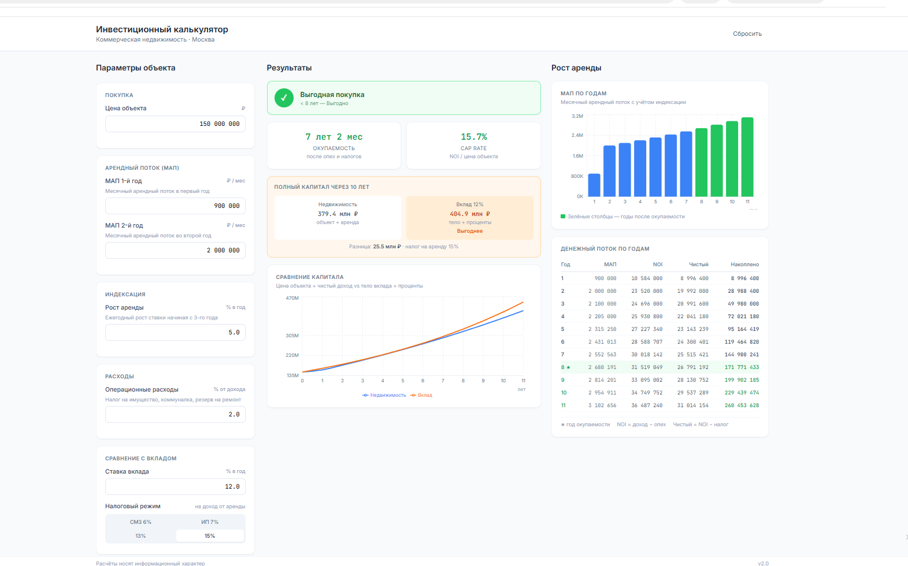
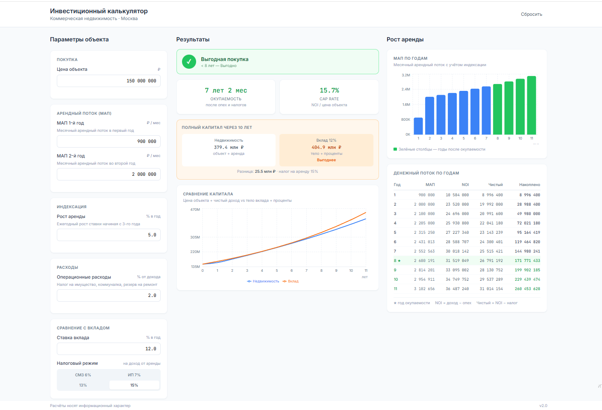

# Инвестиционный калькулятор коммерческой недвижимости

> Быстрая оценка инвестиционной привлекательности объектов стрит-ритейла в Москве

---

## Для кого

Частные инвесторы, которые рассматривают покупку коммерческой недвижимости (стрит-ритейл, офисы, склады) в Москве. Люди с капиталом от 10 млн ₽, которые самостоятельно оценивают объекты без брокера.

---

## Проблема

Инвестор смотрит объект на Avito или CIAN и не понимает — цена адекватная или завышена? Чтобы это посчитать, нужно вручную считать в Excel: окупаемость, доходность, учитывать налоги, индексацию аренды. Большинство этого не делает и либо переплачивает, либо упускает выгодные объекты.

Вторая проблема — нет точки сравнения. На фоне вкладов под 20%+ непонятно, зачем вообще покупать недвижимость.

---

## Решение

Калькулятор за 30 секунд считает реальную картину по объекту:

- Вводишь цену, МАП первого и второго года, индексацию
- Получаешь срок окупаемости **после налогов и операционных расходов**
- Видишь Cap Rate на основе NOI (а не валовой аренды)
- Сравниваешь с банковским вкладом — весь капитал через 10 лет

---

## Преимущества

| # | Что | Почему важно |
|---|-----|-------------|
| 1 | Окупаемость после налогов и расходов | Большинство калькуляторов считают грязными цифрами — это завышает результат |
| 2 | МАП 1-го и 2-го года отдельно | Реальный рынок: первый год часто ниже из-за каникул арендатора |
| 3 | Сравнение с вкладом — полный капитал | Честное сравнение: недвижимость + тело объекта vs вклад + проценты |
| 4 | Цветовой вердикт по рынку Москвы | < 8 лет выгодно, 9–11 рынок, 12+лет - завышено |
| 5 | Выбор налогового режима | СМЗ, ИП, НДФЛ 13/15% — у каждого инвестора своя ситуация |

---

## Стек

- **React + TypeScript** — интерфейс
- **Vite** — сборка
- **Tailwind CSS** — стили
- **Recharts** — графики

---

